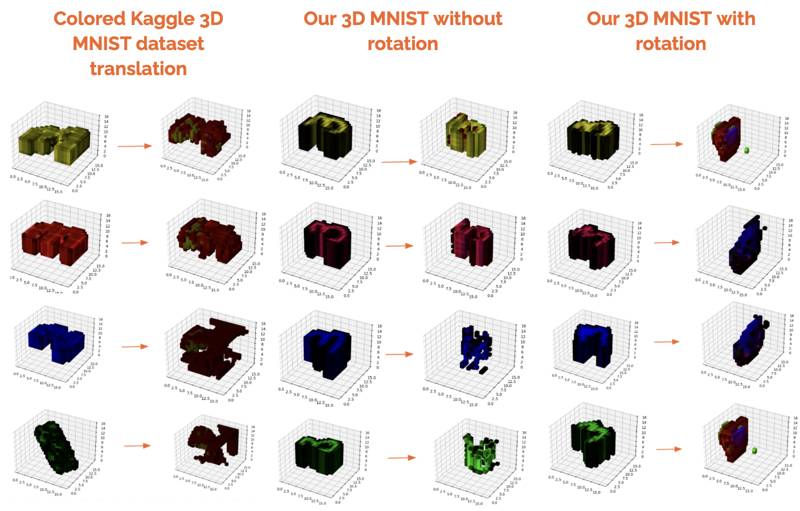
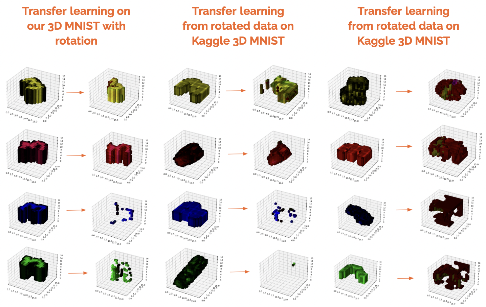

# Unpaired learning with Optimal Transport application to 3D MNIST images

Computational Optimal Transport (OT) is a set of tools, which provide a way of transforming one distribution into another with the minimal effort. Recently scalable neural OT based methods, which do not require paired training dataset, have been developed and applied to a wide range of tasks, including transfer learning, generative modeling and super-resolution.

In this project, we are to implement and train OT approach on 3D MNIST digits dataset, analyze the applicability of OT method to 3D image-to-image translation. Specifically we want to learn a model to transform the 3D digits '3' into 3D digits 5. 

## Presentations
[Project presentation](https://docs.google.com/presentation/d/1ZLkj0lOnnuIK8hhtjRvBW0QwaCBpR4zyPwx0eNloJvc/edit#slide=id.gcb9a0b074_1_0) - official report on this project by our team.

## Related repositories
 - [Repository](https://github.com/iamalexkorotin/NeuralOptimalTransport) for [Neural Optimal Transform](https://arxiv.org/abs/2201.12220)

## Experiments




## Repository structure
``` bash
ML_Project
├── pictures # pictures used in README
│   ├── exp1.png
│   └── exp2.png
├── report # report deliverables
│   ├── presentation.pdf
│   └── report.pdf
├── schemes # contains models schemes and neutron files
│   ├── ResNet.onnx 
│   ├── ResNet.png
│   ├── UNet.onnx
│   └── UNet.png
├── src
│   ├── coloring.py # coloring function for Kaggle and 2D->3D datasets
│   ├── data.py # 3D MNIST Kaggle dataset preprocessing and saving
│   ├── dataset.py # dataloader is defined here
│   ├── netron.py # code for generating models schemes
│   ├── nn_gray.py # models for the grayscale approach and their auxiliary functions
│   ├── nn.py # models for the RGB approach
│   ├── plot.py # contains functions for plotting
│   └── utils.py # configuration file 
├── constructed.ipynb # 2D->3D simple version
├── constructed_rotation.ipynb # 2D->3D with random rotations
├── constructed_tranfer_rotation_kaggle.ipynb # 2D->3D with tranfer learning on 2D->3D with rotations and  on Kaggle dataset
├── constructed_transfer_kaggle.ipynb # 2D->3D with tranfer learning on Kaggle dataset
├── constructed_transfer_rotation.ipynb # 2D->3D with tranfer learning on 2D->3D with rotations
├── kaggle_gray.ipynb # Kaggle grayscale
├── kaggle.ipynb # Kaggle RGB
└── README.md
```

## Datasets

[3D MNIST dataset](https://www.kaggle.com/datasets/daavoo/3d-mnist) - the dataset should be pre-processed with ```src/data.py```
The dataloader can be found in ```src/dataset.py```

[Original 3D MNIST dataset](http://yann.lecun.com/exdb/mnist/) - the datset is pre-processed in Jupyter notebooks with experiments by the functions defined in ```coloring.py```

## Model schemes
Our models schemes can be found in ```schemes``` folder and could be run with [neutron](https://github.com/lutzroeder/netron) visualizer. 


